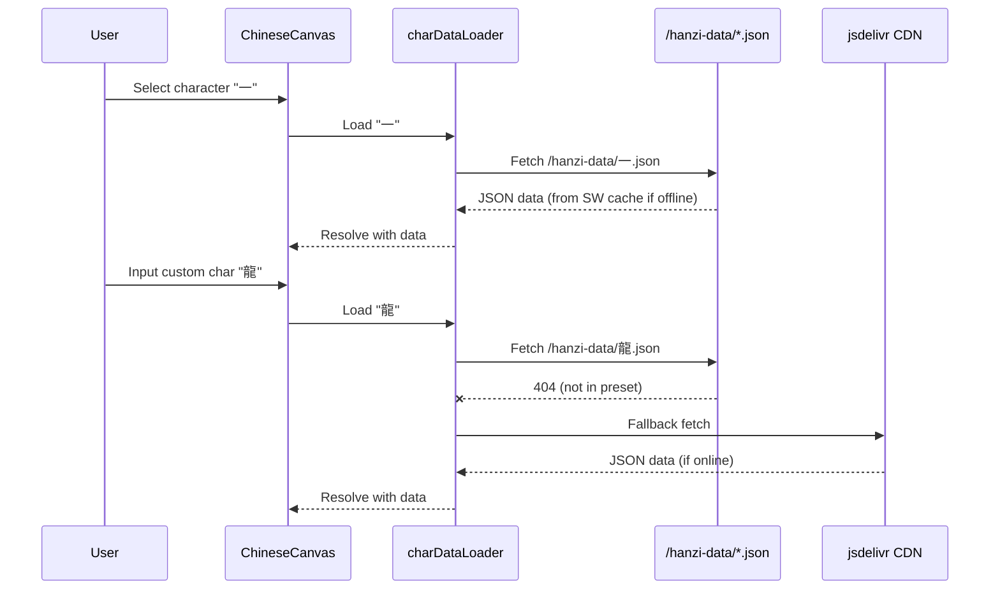

# Design: Offline Data Loading Architecture

## Context
The `hanzi-writer` library defaults to fetching character stroke data from `https://cdn.jsdelivr.net/npm/hanzi-writer-data@2.0/{char}.json` at runtime. This works well for online scenarios but breaks completely when offline. The app has 20 preset Chinese characters that users practice most frequently.

**Stakeholders**: End-users who want offline practice capability, especially on mobile devices.

## Goals
- All 20 preset characters work 100% offline after initial app load/install
- Custom user-input characters gracefully degrade with a friendly error when offline
- No changes to existing UX for online users
- Minimize bundle size impact (lazy load data, not in JS bundle)

## Non-Goals
- Caching all possible Chinese characters (~9,000+)
- Offline support for the download script itself (one-time dev task)
- Background sync for new characters

## Decisions

### Decision 1: Store Character Data in `public/` Folder

**What**: Place JSON files in `public/hanzi-data/{char}.json` so they're served as static assets.

**Why**: 
- Vite serves `public/` files at the root URL, accessible via `/hanzi-data/一.json`
- Service Worker can precache these files automatically
- No bundler overhead; files are copied as-is to `dist/`

**Alternatives considered**:
- ❌ Import JSON into JS bundle: Increases main bundle size, defeats code splitting
- ❌ IndexedDB storage: Requires runtime population, complex synchronization

### Decision 2: Custom `charDataLoader` with Fallback

**What**: Implement a loader function passed to `HanziWriter.create()` that:
1. Check if character is in preset list → fetch from `/hanzi-data/{char}.json`
2. Not in preset list → fetch from CDN (existing behavior)
3. Both fail → reject with offline-specific error

**Why**: 
- `hanzi-writer` already supports `charDataLoader` option for custom loading
- Enables gradual enhancement: preset characters always work, others degrade gracefully

### Decision 3: PWA with `vite-plugin-pwa` Precaching

**What**: Configure `vite-plugin-pwa` to include `/hanzi-data/*.json` in the precache manifest.

**Why**:
- Service Worker installs and caches all assets on first visit
- Subsequent visits are fully offline-capable
- Integrates well with Vite build pipeline

**Configuration approach**:
```ts
VitePWA({
  workbox: {
    globPatterns: ['**/*.{js,css,html,ico,png,svg,json}'],
    // json pattern covers hanzi-data files
  }
})
```

## Data Flow



## Risks / Trade-offs

| Risk | Severity | Mitigation |
|------|----------|------------|
| Increased initial install size (~200KB for 20 chars) | Low | Acceptable for guaranteed offline |
| Preset list falls out of sync with download | Medium | Script reads from `characters.ts` as source of truth |
| CDN URL changes break fallback | Low | Use same version-pinned URL as library default |

## Migration Plan
1. Run `npm run download:hanzi` once to populate `public/hanzi-data/`
2. Commit the JSON files to repository
3. No runtime migration needed; new loader is backwards-compatible

## Open Questions
- Should we add a UI indicator showing offline/online status? (Deferred to future enhancement)
